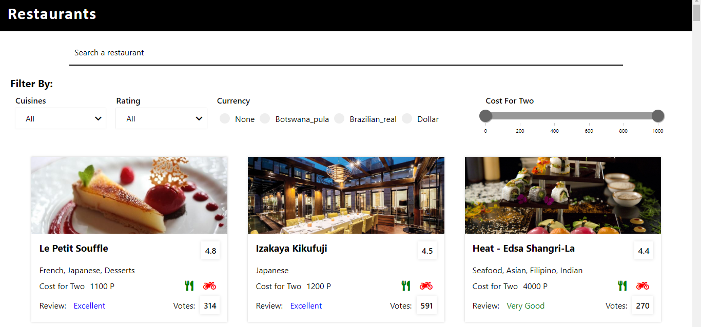

  

###Project Description
This project is build using ReactJs. The main aim of this project is to learn how to :-  

- Read data from a CSV file using _fetch_.
- Apply multiple filters on given list.
- Add _search_ functionality.

Preview

 
### Start working on project
`npm start`

Runs the app in the development mode. 
Open [http://localhost:3000](http://localhost:3000) to view it in the browser.

The page will reload if you make edits. 
You will also see any lint errors in the console.
